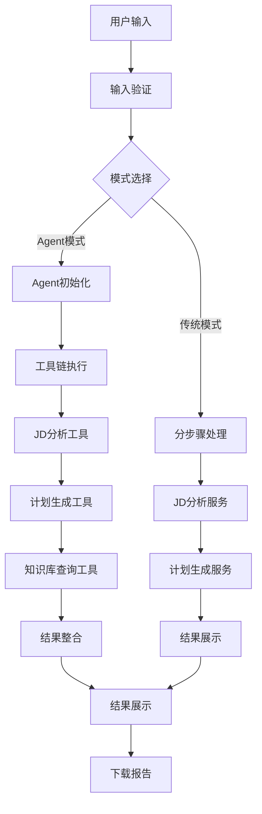

# 📊 核心操作指标与流程优化
## 智能求职助手系统KPI与流程优化方案

---

## 📋 目录
1. [核心操作指标(KPI)](#核心操作指标kpi)
2. [当前流程分析](#当前流程分析)
3. [流程优化方案](#流程优化方案)
4. [性能监控体系](#性能监控体系)
5. [优化实施计划](#优化实施计划)

---

## 🎯 核心操作指标(KPI)

### 1. 用户体验指标

#### A. 响应时间指标
| 指标名称 | 目标值 | 当前值 | 优先级 | 测量方法 |
|----------|--------|--------|--------|----------|
| **页面加载时间** | < 3秒 | 5-8秒 | 🔥🔥🔥 | 浏览器开发者工具 |
| **API响应时间** | < 10秒 | 15-30秒 | 🔥🔥🔥 | 请求时间戳记录 |
| **Agent执行时间** | < 60秒 | 90-180秒 | 🔥🔥 | 执行开始/结束时间 |
| **知识库检索时间** | < 5秒 | 8-15秒 | 🔥🔥 | 向量检索耗时 |

#### B. 成功率指标
| 指标名称 | 目标值 | 当前值 | 优先级 | 测量方法 |
|----------|--------|--------|--------|----------|
| **API调用成功率** | > 95% | 70-80% | 🔥🔥🔥 | 成功请求/总请求 |
| **Agent执行成功率** | > 90% | 60-70% | 🔥🔥🔥 | 成功执行/总执行 |
| **RAG检索成功率** | > 85% | 75-85% | 🔥🔥 | 成功检索/总检索 |
| **用户任务完成率** | > 80% | 65-75% | 🔥🔥 | 完成任务/开始任务 |

#### C. 用户满意度指标
| 指标名称 | 目标值 | 当前值 | 优先级 | 测量方法 |
|----------|--------|--------|--------|----------|
| **功能可用性** | > 98% | 85-90% | 🔥🔥🔥 | 可用时间/总时间 |
| **输出质量评分** | > 4.0/5.0 | 3.5-4.0 | 🔥🔥 | 用户反馈评分 |
| **用户留存率** | > 60% | 40-50% | 🔥🔥 | 重复使用用户比例 |
| **推荐意愿度** | > 70% | 50-60% | 🔥 | NPS评分 |

### 2. 技术性能指标

#### A. 系统性能指标
| 指标名称 | 目标值 | 当前值 | 优先级 | 测量方法 |
|----------|--------|--------|--------|----------|
| **CPU使用率** | < 70% | 80-90% | 🔥🔥🔥 | 系统监控 |
| **内存使用率** | < 80% | 85-95% | 🔥🔥🔥 | 系统监控 |
| **磁盘I/O** | < 50MB/s | 60-80MB/s | 🔥🔥 | 系统监控 |
| **网络延迟** | < 100ms | 150-300ms | 🔥🔥 | 网络监控 |

#### B. API性能指标
| 指标名称 | 目标值 | 当前值 | 优先级 | 测量方法 |
|----------|--------|--------|--------|----------|
| **Moonshot API成功率** | > 95% | 70-80% | 🔥🔥🔥 | API调用日志 |
| **OpenAI API成功率** | > 95% | 85-90% | 🔥🔥 | API调用日志 |
| **Token消耗效率** | < 1000/次 | 1200-1500/次 | 🔥🔥 | Token计数 |
| **并发处理能力** | > 10用户 | 3-5用户 | 🔥🔥🔥 | 压力测试 |

#### C. 数据质量指标
| 指标名称 | 目标值 | 当前值 | 优先级 | 测量方法 |
|----------|--------|--------|--------|----------|
| **知识库覆盖率** | > 90% | 75-85% | 🔥🔥 | 文档分析 |
| **向量检索准确率** | > 85% | 80-85% | 🔥🔥 | 相关性评估 |
| **输出内容完整性** | > 90% | 85-90% | 🔥🔥 | 内容分析 |
| **格式一致性** | > 95% | 90-95% | 🔥 | 格式检查 |

### 3. 业务价值指标

#### A. 功能使用指标
| 指标名称 | 目标值 | 当前值 | 优先级 | 测量方法 |
|----------|--------|--------|--------|----------|
| **JD分析使用率** | > 80% | 70-80% | 🔥🔥🔥 | 功能调用统计 |
| **计划生成使用率** | > 60% | 50-60% | 🔥🔥 | 功能调用统计 |
| **Agent模式使用率** | > 40% | 30-40% | 🔥🔥 | 功能调用统计 |
| **知识库查询使用率** | > 50% | 40-50% | 🔥 | 功能调用统计 |

#### B. 成本效益指标
| 指标名称 | 目标值 | 当前值 | 优先级 | 测量方法 |
|----------|--------|--------|--------|----------|
| **API成本/用户** | < ¥5/次 | ¥8-12/次 | 🔥🔥🔥 | 成本统计 |
| **服务器成本/月** | < ¥500/月 | ¥800-1200/月 | 🔥🔥 | 成本统计 |
| **维护成本/月** | < ¥2000/月 | ¥3000-5000/月 | 🔥🔥 | 成本统计 |
| **ROI比率** | > 3:1 | 2:1-2.5:1 | 🔥🔥🔥 | 收益/成本 |

---

## 🔄 当前流程分析

### 1. 用户请求处理流程

#### 当前流程图


#### 流程瓶颈分析
| 流程节点 | 当前耗时 | 瓶颈原因 | 影响程度 |
|----------|----------|----------|----------|
| **Agent初始化** | 5-10秒 | 工具加载和验证 | 🔥🔥 |
| **JD分析工具** | 15-30秒 | API限流和重试 | 🔥🔥🔥 |
| **计划生成工具** | 10-20秒 | API调用延迟 | 🔥🔥 |
| **知识库查询** | 8-15秒 | 向量检索性能 | 🔥🔥 |
| **结果整合** | 3-5秒 | 数据格式化 | 🔥 |

### 2. 数据处理流程

#### 当前数据处理流程


#### 数据处理瓶颈
| 处理阶段 | 当前耗时 | 优化空间 | 优先级 |
|----------|----------|----------|--------|
| **数据验证** | 1-2秒 | 低 | 🔥 |
| **内容预处理** | 2-3秒 | 中 | 🔥🔥 |
| **API调用** | 15-30秒 | 高 | 🔥🔥🔥 |
| **结果处理** | 3-5秒 | 中 | 🔥🔥 |
| **格式转换** | 1-2秒 | 低 | 🔥 |

### 3. 错误处理流程

#### 当前错误处理机制
```python
# 当前错误处理流程
try:
    # 执行主要逻辑
    result = process_request()
    return result
except Exception as e:
    # 简单错误返回
    return {"error": str(e)}
```

#### 错误处理问题
| 问题类型 | 影响程度 | 当前处理 | 改进需求 |
|----------|----------|----------|----------|
| **API限流** | 🔥🔥🔥 | 简单重试 | 智能重试策略 |
| **网络超时** | 🔥🔥 | 超时返回 | 连接池管理 |
| **数据格式错误** | 🔥🔥 | 验证失败 | 自动修复 |
| **系统资源不足** | 🔥🔥🔥 | 服务不可用 | 降级服务 |

---

## 🚀 流程优化方案

### 1. 短期优化 (1-2周)

#### A. 响应时间优化
```python
# 优化前：串行处理
def process_request_old():
    result1 = step1()  # 15秒
    result2 = step2()  # 20秒
    result3 = step3()  # 10秒
    return combine_results([result1, result2, result3])  # 总耗时45秒

# 优化后：并行处理
import asyncio
async def process_request_new():
    tasks = [
        asyncio.create_task(step1()),  # 15秒
        asyncio.create_task(step2()),  # 20秒
        asyncio.create_task(step3())   # 10秒
    ]
    results = await asyncio.gather(*tasks)  # 总耗时20秒
    return combine_results(results)
```

#### B. 缓存机制优化
```python
class ResponseCache:
    def __init__(self):
        self.cache = {}
        self.ttl = 3600  # 1小时过期
    
    def get_cached_response(self, request_hash):
        """获取缓存的响应"""
        if request_hash in self.cache:
            result, timestamp = self.cache[request_hash]
            if time.time() - timestamp < self.ttl:
                return result
        return None
    
    def cache_response(self, request_hash, response):
        """缓存响应结果"""
        self.cache[request_hash] = (response, time.time())
```

#### C. 输入预处理优化
```python
class InputPreprocessor:
    def __init__(self):
        self.max_length = 2000
        self.min_length = 50
    
    def preprocess_input(self, content):
        """预处理输入内容"""
        # 1. 长度检查
        if len(content) < self.min_length:
            raise ValueError("内容长度不足")
        
        # 2. 长度截断
        if len(content) > self.max_length:
            content = content[:self.max_length] + "..."
        
        # 3. 格式清理
        content = self.clean_format(content)
        
        # 4. 敏感信息过滤
        content = self.filter_sensitive_info(content)
        
        return content
```

### 2. 中期优化 (1-2月)

#### A. 智能重试机制
```python
class SmartRetryManager:
    def __init__(self):
        self.retry_strategies = {
            "rate_limit": ExponentialBackoffRetry(),
            "timeout": LinearBackoffRetry(),
            "network_error": CircuitBreakerRetry()
        }
    
    async def execute_with_retry(self, func, error_type="rate_limit"):
        """智能重试执行"""
        strategy = self.retry_strategies[error_type]
        
        for attempt in range(strategy.max_attempts):
            try:
                return await func()
            except Exception as e:
                if strategy.should_retry(e, attempt):
                    await strategy.wait(attempt)
                    continue
                else:
                    raise e
```

#### B. 连接池管理
```python
class ConnectionPool:
    def __init__(self, max_connections=10):
        self.max_connections = max_connections
        self.active_connections = 0
        self.connection_queue = asyncio.Queue()
    
    async def get_connection(self):
        """获取连接"""
        if self.active_connections < self.max_connections:
            self.active_connections += 1
            return await self.create_connection()
        else:
            return await self.connection_queue.get()
    
    async def release_connection(self, connection):
        """释放连接"""
        self.active_connections -= 1
        if not self.connection_queue.empty():
            await self.connection_queue.put(connection)
```

#### C. 负载均衡
```python
class LoadBalancer:
    def __init__(self):
        self.servers = [
            {"url": "api1.moonshot.cn", "weight": 1, "health": 1.0},
            {"url": "api2.moonshot.cn", "weight": 1, "health": 1.0},
            {"url": "api3.moonshot.cn", "weight": 1, "health": 1.0}
        ]
    
    def select_server(self):
        """选择最优服务器"""
        available_servers = [s for s in self.servers if s["health"] > 0.5]
        if not available_servers:
            raise Exception("No available servers")
        
        # 加权随机选择
        total_weight = sum(s["weight"] for s in available_servers)
        random_weight = random.uniform(0, total_weight)
        
        current_weight = 0
        for server in available_servers:
            current_weight += server["weight"]
            if random_weight <= current_weight:
                return server
        
        return available_servers[0]
```

### 3. 长期优化 (3-6月)

#### A. 微服务架构
```python
# 服务拆分
services = {
    "jd_analysis": JDAnalysisService(),
    "schedule_generation": ScheduleService(),
    "knowledge_base": KnowledgeService(),
    "user_management": UserService()
}

# API网关
@app.route('/api/v1/analyze', methods=['POST'])
def analyze_endpoint():
    return services['jd_analysis'].process(request.json)

@app.route('/api/v1/schedule', methods=['POST'])
def schedule_endpoint():
    return services['schedule_generation'].process(request.json)
```

#### B. 事件驱动架构
```python
class EventBus:
    def __init__(self):
        self.subscribers = {}
    
    def subscribe(self, event_type, handler):
        """订阅事件"""
        if event_type not in self.subscribers:
            self.subscribers[event_type] = []
        self.subscribers[event_type].append(handler)
    
    def publish(self, event_type, data):
        """发布事件"""
        if event_type in self.subscribers:
            for handler in self.subscribers[event_type]:
                asyncio.create_task(handler(data))

# 事件处理
@event_bus.subscribe("jd_analysis_completed")
async def handle_analysis_completed(data):
    """处理JD分析完成事件"""
    await schedule_service.generate_plan(data)

@event_bus.subscribe("schedule_generated")
async def handle_schedule_generated(data):
    """处理计划生成完成事件"""
    await notification_service.send_notification(data)
```

#### C. 自适应优化
```python
class AdaptiveOptimizer:
    def __init__(self):
        self.performance_history = []
        self.optimization_rules = []
    
    def collect_metrics(self, metrics):
        """收集性能指标"""
        self.performance_history.append(metrics)
        
        # 分析趋势
        if len(self.performance_history) >= 10:
            trend = self.analyze_trend()
            if trend == "degrading":
                self.apply_optimization()
    
    def apply_optimization(self):
        """应用优化策略"""
        current_load = self.get_current_load()
        
        if current_load > 80:
            # 高负载优化
            self.enable_caching()
            self.reduce_concurrency()
        elif current_load < 30:
            # 低负载优化
            self.increase_concurrency()
            self.enable_advanced_features()
```

---

## 📊 性能监控体系

### 1. 监控指标定义

#### A. 实时监控指标
```python
class PerformanceMonitor:
    def __init__(self):
        self.metrics = {
            "response_time": [],
            "success_rate": [],
            "error_rate": [],
            "throughput": [],
            "resource_usage": []
        }
    
    def record_metric(self, metric_type, value):
        """记录性能指标"""
        self.metrics[metric_type].append({
            "value": value,
            "timestamp": time.time()
        })
        
        # 保持最近1000个数据点
        if len(self.metrics[metric_type]) > 1000:
            self.metrics[metric_type].pop(0)
    
    def get_average(self, metric_type, window=100):
        """获取平均值"""
        recent_data = self.metrics[metric_type][-window:]
        if not recent_data:
            return 0
        return sum(d["value"] for d in recent_data) / len(recent_data)
```

#### B. 告警机制
```python
class AlertManager:
    def __init__(self):
        self.alert_rules = {
            "response_time": {"threshold": 10, "operator": ">"},
            "success_rate": {"threshold": 0.9, "operator": "<"},
            "error_rate": {"threshold": 0.1, "operator": ">"},
            "cpu_usage": {"threshold": 0.8, "operator": ">"}
        }
    
    def check_alerts(self, metrics):
        """检查告警条件"""
        alerts = []
        
        for metric_name, rule in self.alert_rules.items():
            if metric_name in metrics:
                value = metrics[metric_name]
                threshold = rule["threshold"]
                operator = rule["operator"]
                
                if self.evaluate_condition(value, operator, threshold):
                    alerts.append({
                        "metric": metric_name,
                        "value": value,
                        "threshold": threshold,
                        "timestamp": time.time()
                    })
        
        return alerts
```

### 2. 数据收集与分析

#### A. 数据收集
```python
class DataCollector:
    def __init__(self):
        self.collectors = {
            "api_calls": APICallCollector(),
            "user_actions": UserActionCollector(),
            "system_metrics": SystemMetricsCollector(),
            "error_logs": ErrorLogCollector()
        }
    
    def collect_all_metrics(self):
        """收集所有指标"""
        metrics = {}
        
        for collector_name, collector in self.collectors.items():
            try:
                metrics[collector_name] = collector.collect()
            except Exception as e:
                logger.error(f"Failed to collect {collector_name}: {e}")
        
        return metrics
```

#### B. 数据分析
```python
class DataAnalyzer:
    def __init__(self):
        self.analysis_models = {
            "trend_analysis": TrendAnalysisModel(),
            "anomaly_detection": AnomalyDetectionModel(),
            "performance_prediction": PerformancePredictionModel()
        }
    
    def analyze_performance(self, metrics_data):
        """分析性能数据"""
        analysis_results = {}
        
        # 趋势分析
        analysis_results["trends"] = self.analysis_models["trend_analysis"].analyze(
            metrics_data
        )
        
        # 异常检测
        analysis_results["anomalies"] = self.analysis_models["anomaly_detection"].detect(
            metrics_data
        )
        
        # 性能预测
        analysis_results["predictions"] = self.analysis_models["performance_prediction"].predict(
            metrics_data
        )
        
        return analysis_results
```

---

## 🎯 优化实施计划

### 1. 实施阶段规划

#### 阶段一：基础优化 (1-2周)
| 优化项 | 预期效果 | 实施难度 | 优先级 |
|--------|----------|----------|--------|
| **缓存机制** | 响应时间减少30% | 低 | 🔥🔥🔥 |
| **输入预处理** | 错误率减少20% | 低 | 🔥🔥🔥 |
| **并行处理** | 总耗时减少40% | 中 | 🔥🔥🔥 |

#### 阶段二：架构优化 (1-2月)
| 优化项 | 预期效果 | 实施难度 | 优先级 |
|--------|----------|----------|--------|
| **智能重试** | 成功率提升15% | 中 | 🔥🔥🔥 |
| **连接池管理** | 并发能力提升50% | 中 | 🔥🔥🔥 |
| **负载均衡** | 可用性提升10% | 高 | 🔥🔥 |

#### 阶段三：智能化 (3-6月)
| 优化项 | 预期效果 | 实施难度 | 优先级 |
|--------|----------|----------|--------|
| **微服务架构** | 可扩展性提升100% | 高 | 🔥🔥 |
| **事件驱动** | 响应速度提升60% | 高 | 🔥🔥 |
| **自适应优化** | 性能自动优化 | 高 | 🔥 |

### 2. 风险控制

#### A. 技术风险
| 风险类型 | 影响程度 | 缓解措施 | 监控指标 |
|----------|----------|----------|----------|
| **API限流加剧** | 🔥🔥🔥 | 多API轮换、本地模型 | 成功率、响应时间 |
| **系统稳定性** | 🔥🔥🔥 | 灰度发布、回滚机制 | 错误率、可用性 |
| **数据一致性** | 🔥🔥 | 事务管理、数据验证 | 数据完整性 |
| **性能退化** | 🔥🔥 | A/B测试、性能监控 | 响应时间、吞吐量 |

#### B. 业务风险
| 风险类型 | 影响程度 | 缓解措施 | 监控指标 |
|----------|----------|----------|----------|
| **用户体验下降** | 🔥🔥🔥 | 用户反馈、快速迭代 | 满意度、留存率 |
| **成本增加** | 🔥🔥 | 成本监控、优化策略 | 成本/用户、ROI |
| **功能可用性** | 🔥🔥🔥 | 降级服务、备用方案 | 功能可用性 |
| **数据安全** | 🔥🔥🔥 | 加密传输、访问控制 | 安全事件 |

### 3. 成功标准

#### A. 性能指标
- **响应时间**: 平均响应时间 < 10秒
- **成功率**: API调用成功率 > 95%
- **并发能力**: 支持 > 10用户同时使用
- **可用性**: 系统可用性 > 99%

#### B. 用户体验指标
- **功能可用性**: 核心功能可用性 > 98%
- **用户满意度**: 平均评分 > 4.0/5.0
- **任务完成率**: 用户任务完成率 > 80%
- **推荐意愿**: NPS评分 > 70

#### C. 成本效益指标
- **API成本**: 平均成本 < ¥5/用户
- **服务器成本**: 月成本 < ¥500
- **维护成本**: 月成本 < ¥2000
- **ROI比率**: 收益/成本 > 3:1

---

## 📈 总结

### 核心操作指标体系
- **用户体验指标**: 响应时间、成功率、满意度
- **技术性能指标**: 系统性能、API性能、数据质量
- **业务价值指标**: 功能使用率、成本效益

### 流程优化策略
- **短期优化**: 缓存、并行处理、输入预处理
- **中期优化**: 智能重试、连接池、负载均衡
- **长期优化**: 微服务、事件驱动、自适应优化

### 监控与实施
- **性能监控**: 实时监控、告警机制、数据分析
- **风险控制**: 技术风险、业务风险、缓解措施
- **成功标准**: 性能指标、用户体验、成本效益

**通过系统性的指标监控和流程优化，可以显著提升系统性能、用户体验和业务价值！** 🚀✨ 